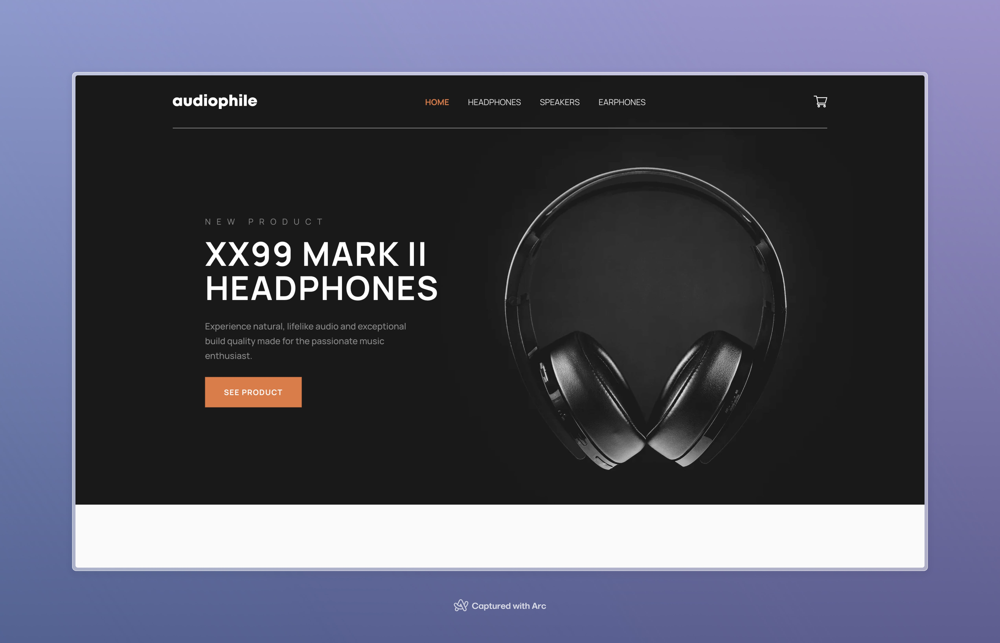

# Frontend Mentor - Audiophile e-commerce website solution

This is a solution to the [Audiophile e-commerce website challenge on Frontend Mentor](https://www.frontendmentor.io/challenges/audiophile-ecommerce-website-C8cuSd_wx). Frontend Mentor challenges help you improve your coding skills by building realistic projects.

## Table of contents

- [Overview](#overview)
  - [The challenge](#the-challenge)
  - [Screenshot](#screenshot)
  - [Links](#links)
- [My process](#my-process)
  - [Built with](#built-with)
- [Author](#author)

## Overview

### The challenge

Users should be able to:

- View the optimal layout for the app depending on their device's screen size
- See hover states for all interactive elements on the page
- Add/Remove products from the cart
- Edit product quantities in the cart
- Fill in all fields in the checkout
- Receive form validations if fields are missed or incorrect during checkout
- See correct checkout totals depending on the products in the cart
  - Shipping always adds $50 to the order
  - VAT is calculated as 20% of the product total, excluding shipping
- See an order confirmation modal after checking out with an order summary
- **Bonus**: Keep track of what's in the cart, even after refreshing the browser (`localStorage` could be used for this if you're not building out a full-stack app)

### Screenshot

### Links

- Solution URL: [https://www.frontendmentor.io/solutions/audiophile-e-commerce-website-with-redux-toolkit-VJ6-6n7co3](https://www.frontendmentor.io/solutions/audiophile-e-commerce-website-with-redux-toolkit-VJ6-6n7co3)
- Live Site URL: [https://audiophile-by-samuel-adu.vercel.app](https://audiophile-by-samuel-adu.vercel.app)

## My process

### Built with

- Semantic HTML5 markup
- CSS custom properties
- Flexbox
- CSS Grid
- Mobile-first workflow
- [React](https://reactjs.org/) - JS library
- [Redux Toolkit]() - State management
- [React Router](https://reactrouter.com/en) - Routing
- [React Hook Form](https://www.react-hook-form.com/) - Form validation
- [Tailwind CSS](https://tailwindcss.com/) - For styles

## Author

- Website - [Samuel Adu](https://www.samueladu.dev)
- Frontend Mentor - [@samuel-adu](https://www.frontendmentor.io/profile/samuel-adu)
- LinkedIn - [@samuel-oa](https://www.linkedin.com/in/samuel-oa/)
